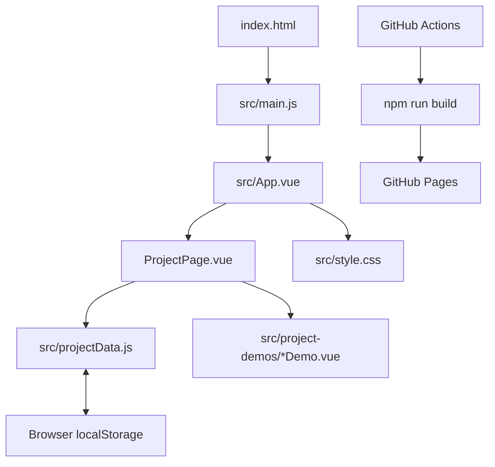

# Project Guide

This guide explains how the portfolio is put together, where to make common changes, and what happens when someone interacts with it.

## At a glance

The application is a Vue single-page app. Vite serves it during development and produces the static files that GitHub Pages hosts. There is no application server or database in this repository.



## Source map

| Path | What it does |
| --- | --- |
| `index.html` | HTML shell and browser metadata. Vite injects the compiled app into `#app`. |
| `src/main.js` | Creates the Vue app, imports the global stylesheet, and mounts `App.vue`. |
| `src/App.vue` | Owns portfolio sections, navigation, contact form prototype, project catalog, and hash-based project view. |
| `src/ProjectPage.vue` | Displays project details, status and note controls, and the selected interactive demo. |
| `src/projectData.js` | Stores shared project details, default demo data, and safe browser storage read/write helpers. |
| `src/project-demos/` | One Vue component for each interactive product example. |
| `src/style.css` | Imports Tailwind CSS and defines the portfolio design, responsive rules, animation, and reduced-motion support. |
| `src/assets/img/` | The portrait images used in the homepage. |
| `vite.config.js` | Enables Vue and Tailwind's Vite plugin and chooses the deployment base path. |
| `.github/workflows/jekyll-gh-pages.yml` | Despite its legacy filename, this is the Node/Vite GitHub Pages deployment workflow. |

## How the page works

### Portfolio sections

`App.vue` renders the home, about, projects, experience, and contact sections. The desktop navigation tracks the visible section as the page scrolls. On small screens, the same destinations are placed in a toggleable menu. The image reveal effect uses `IntersectionObserver`; reduced-motion preferences disable the decorative motion. Since Vue replaces the homepage while a project is open, the observer is reconnected after returning so recreated image wrappers can reveal again.

The project cards are powered by a local array in `App.vue`. Clicking anywhere on a card opens its project workspace in the current tab; its title link is keyboard accessible too. The card's explicit **Open website** action opens the standalone presentation in a new tab and remains independent of the full-card link.

### Project links and views

Project workspaces use the URL hash so each view can be opened directly without a server-side router:

```text
#project-1          Project 1 workspace
#project-1/full     Project 1 standalone presentation
```

On startup, `App.vue` reads the hash and chooses the matching view. Selecting **Back to portfolio** clears the hash and returns to the homepage. The `ProjectPage.vue` component maps project IDs 1 through 6 to the appropriate demo component.

### Demo data and browser storage

`projectData.js` supplies default state for each project and stores saved values under the localStorage key `devoy-portfolio-project-state`. Each demo reads and writes its own project entry through `getProjectStateStore()` and `saveProjectStateStore()`. This persistence is local to the browser and origin; it is not shared between visitors or devices.

To reset the sample state, clear that key in the browser's developer tools under **Application/Storage → Local Storage**, or clear the site's local storage entirely.

### Contact form

The contact form currently simulates a short send delay, then resets its fields. It has no email service or API behind it. Before using it to receive real messages, connect a form provider or add a backend endpoint and update `submitForm()` in `App.vue`.

## Common edits

- **Change the introduction, biography, skills, experience, or contact details:** edit the corresponding template content and arrays in `src/App.vue`.
- **Change project card content:** update the `projects` array in `src/App.vue`.
- **Change project workspace metadata or initial demo state:** update `projects` or `defaultDemoForProject()` in `src/projectData.js`.
- **Change how a demo behaves:** edit its component in `src/project-demos/`.
- **Change colors, spacing, typography, or responsive behavior:** edit `src/style.css`. Utility classes are available through Tailwind CSS 4.
- **Change page title or search preview text:** edit the metadata in `index.html`.

When adding a project, keep its ID consistent between the `App.vue` project list, `projectData.js`, the `demoComponent` map in `ProjectPage.vue`, and `defaultDemoForProject()` if the demo needs saved state.

## Run and build

Use Node.js 20.19 or newer (or 22.12 or newer), as required by Vite 7.

```sh
npm ci
npm run dev
```

Create a production bundle and serve it locally with:

```sh
npm run build
npm run preview
```

Vite writes deployable files to `dist/`. The checked-in `docs/` directory contains a separate static site snapshot; the automated workflow deploys `dist/`, not that snapshot.

## GitHub Pages deployment

The workflow in `.github/workflows/jekyll-gh-pages.yml` runs when code is pushed to `main`, and can also be started manually. It checks out the repository, installs the lockfile dependencies with `npm ci`, runs the production build, uploads `dist/`, then deploys that artifact.

In the repository, set **Settings → Pages → Build and deployment → Source** to **GitHub Actions**. The workflow needs the `pages: write` and `id-token: write` permissions already declared in its YAML.

`vite.config.js` reads `GITHUB_REPOSITORY` during Actions builds and uses the repository name as the base URL. This supports project Pages sites such as `https://account.github.io/Portfolio2/`. Outside Actions, the base remains `/` for local development.

## Dependencies

- **Vue 3** builds the interface from single-file components.
- **Vite** handles the dev server and production bundling.
- **Tailwind CSS 4** supplies utility classes through `@tailwindcss/vite`; custom site styling lives alongside it in `src/style.css`.
- **lucide-vue-next** supplies interface icons.

There is currently no test script in `package.json`. The production check is `npm run build`.
